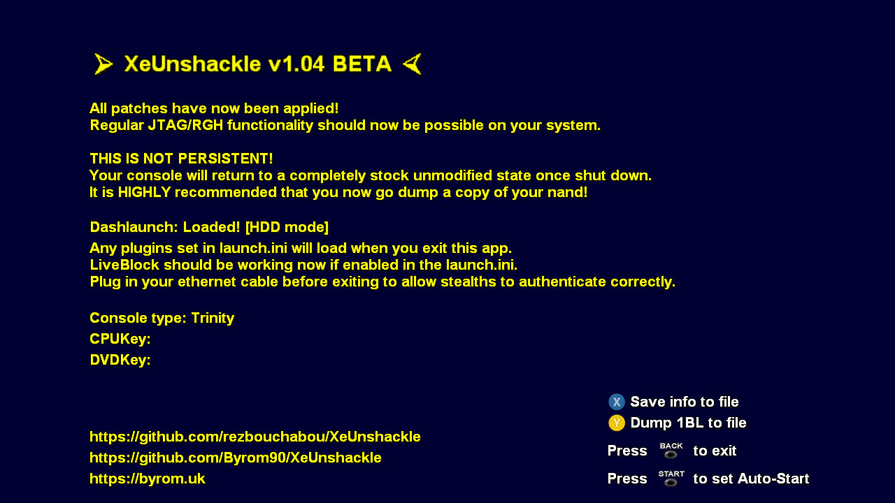

# XeUnshackle 1.03 BETA

Custom Xbox 360 application designed to be used with:
[Xbox360BadUpdate](https://github.com/grimdoomer/Xbox360BadUpdate) exploit.
[ABadAvatar](https://github.com/shutterbug2000/ABadAvatar) exploit.  

## WHAT'S NEW
- Remove the video animation completely.
- Ability to set "Auto-Start" via START button. This permanently skips the simple GUI after a short delay, which can be customized in the XeUnshackleAutoStart.txt file. (0.00 skip the app completely) (Credited to: https://github.com/klofi)
- Changes some UI

IMPORTANT: THIS IS NOT A PERMANENT MODIFICATION. YOUR CONSOLE WILL RETURN TO ITS ORIGINAL STATE UPON SHUTDOWN OR REBOOT. USE AT YOUR OWN RISK.

## SETUP INSTRUCTIONS
# Format USB Drive:
- Format your USB drive using your Xbox 360 console. Then, copy all the provided files to the USB drive.

- First-Time Setup:

- If this is your first time running XeUnshackle, delete the XeUnshackleAutoStart.txt file from the BadUpdatePayload folder. This allows the app to run and dump necessary files (see Step 6).

- If you have already saved the required files, keep XeUnshackleAutoStart.txt (set to 0.00) to bypass the app and redirect directly to the Xbox Home after the exploit.

- Prepare Console:
- Insert the USB drive into your Xbox 360.
- Recommended: Disconnect Ethernet or Wi-Fi to prevent connections to Xbox Live.

- Run Exploit:
- Power on the console. You should see an ABadAvatar pop-up message. Wait for the exploit to complete successfully.

- Post-Exploit:
- After a successful exploit, the XeUnshackle app will load.
- Optional: Reconnect Ethernet/Wi-Fi at this point if needed.

- Save Console Data:

- Press X to save console information.

- Press Y to dump the 1bl file.
- (The original MAC address is dumped automatically.)

- Enable Auto-Start:
- Press Start to enable auto-start. On subsequent exploits, you will be redirected directly to Xbox Home.

## USAGE NOTES
- XEX Files: No patching is required. Any software that runs on RGH/JTAG consoles should work.

- Configuration Files:
- Store your launch.ini (Dashlaunch config) and plugins on a USB drive for easy editing.

- Plugins:
- Plugins load when you exit the app. Insert Ethernet before exiting if using network-dependent plugins (e.g., stealth servers).

- Dashlaunch Dependency:
- A key executable required by Dashlaunch is copied to your storage device. If no HDD is present, this is the USB drive. Keep it connected for Dashlaunch to function.

- Remote Access:
- The provided files and config enable remote access via Xbox Neighborhood and JRPC2-based tools.

- Important Note: Stealth Servers
- Use stealth servers at your own risk. Unlike modded consoles, retail systems cannot be unbanned if detected.

- NAND Backup:
- Highly recommended to dump your NAND before using any stealth server plugin.

- MAC Address Change:
- Stealth plugins often change the console’s MAC address. This change is persistent and stored in the NAND.

- MAC Backup:
- A backup of your original MAC address is automatically created in the BadUpdatePayload folder on first launch.

## RECOMMENDED APPS
- Simple 360 NAND Flasher
- XEXMenu

## DISCLAIMER
YOU ARE SOLELY RESPONSIBLE FOR ANY CHANGES MADE TO YOUR CONSOLE AND ANY RESULTING CONSEQUENCES. USE THIS SOFTWARE WITH CAUTION.

> [!IMPORTANT]  
> **THIS APP IS RELEASED AS IS.**  
> **YOU ARE RESPONSIBLE FOR WHAT YOU CHOOSE TO LOAD AND ANY NEGATIVE EFFECTS THAT MAY COME AS A RESULT.**  
> **THIS IS NOT A PERMANENT SOFTMOD!** Your console will return to an unmodified state when powered off or rebooted.

> [!CAUTION]
> * **BACKUP YOUR NAND!** This should be the first thing you do.
> * **DO NOT FLASH MODIFIED NAND IMAGES!** You will **brick** your console.
> * **DO NOT REPLACE FILES IN FLASH!** This includes things like replacing the bootanim.
> * Avoid using homebrew or plugins that make changes to FLASH (the nand).
> * Read the **README - IMPORTANT.txt** in the release files for important notes regarding the use of Stealth Servers.

Utilises the _alternate_ method of using a specially crafted PeekPoke HV expansion to apply **temporary** HV patches.  
This is usually the preferred method of HV access used by Stealth servers.  
Access via the Syscall0 backdoor is also available upon completion for apps requiring it (Simple 360 NAND Flasher for example).  

Nothing here is particularly new. It's simply a collection of existing code that has been adapted and packaged for use with this exploit.

## Features
- Applies a full complete patchset of both HV & Kernel patches. These are the same exact patches that are usually applied when building a modified nand image using xeBuild for RGH/JTAG consoles.
- Support for both Retail & Devkit signed xex files. Essentially any plugins or executables that run natively on RGH/JTAG modified consoles _should_ work.
- Reverts any patches applied by the [Xbox360BadUpdate](https://github.com/grimdoomer/Xbox360BadUpdate) exploit we no longer need.
- Restores the default state of the Ring of Light and allows controller syncing to function as normal. Thanks [InvoxiPlayGames](https://github.com/InvoxiPlayGames)
- Loads a slightly modified version of launch.xex (Dashlaunch). Due to it not being stored within the nands filesystem it is loaded from app memory and lhelper.xex is copied to either Hdd or Usb root depending on what's available at load time.
- Simple GUI displaying both the CPUKey and DVDKey of the console.
- Ability to dump 1BL to file via button press. This may be particularly useful for those wanting to use the Low Level [Xenon](https://github.com/xenon-emu/xenon) Emulator.
- Automatic dumping of the current MAC address on first load. This is often changed by stealth servers during the initial KV spoofing. Only other way to retrieve the original is from a nand backup taken BEFORE loading a stealth.
- Applies Usbdsec patches to allow non-360 XInput controllers. Thanks [InvoxiPlayGames](https://github.com/InvoxiPlayGames)

## Usage
#### Dashlaunch Plugin Loading:
1. Add the plugins you want to load to the [Plugins] section of the launch.ini provided and copy it to the root of the usb. 
2. Copy any plugin files to the usb.  
Upon successful exploit XeUnshackle will run and attempt to load launch.xex (Dashlaunch) in the background.  
Dashlaunch will then attempt to load any plugins set when exiting the app and returning to the dashboard.

#### Save / Dump Options:
Any files saved/dumped can be found in the BadUpdatePayload folder of the usb.

## Credits
- [Byrom90](https://github.com/Byrom90) - [XeUnshackle](https://github.com/Byrom90/XeUnshackle) app
- [grimdoomer](https://github.com/grimdoomer) - [Xbox360BadUpdate](https://github.com/grimdoomer/Xbox360BadUpdate) exploit
- [shutterbug2000](https://github.com/shutterbug2000) - [ABadAvatar](https://github.com/shutterbug2000/ABadAvatar) exploit
- cOz - xeBuild patches, Dashlaunch & much more
- [Visual Studio / Goobycorp](https://github.com/GoobyCorp)
- Diamond
- [InvoxiPlayGames / Emma](https://github.com/InvoxiPlayGames) - [FreeMyXe](https://github.com/FreeMyXe), [Usbdsec patches](https://github.com/InvoxiPlayGames/UsbdSecPatch), Ring of Light fix, [DaTArrest save exploit](https://github.com/RBEnhanced/DaTArrest) & general help
- [ihatecompvir](https://github.com/ihatecompvir) - [DaTArrest save exploit](https://github.com/RBEnhanced/DaTArrest)
- ikari - freeBOOT
- [Jeff Hamm](https://www.youtube.com/watch?v=PantVXVEVUg) - Chain break video
- [Xbox360Hub Discord #coding-corner](https://xbox360hub.com/)
- Anyone else who has contributed anything to the 360 scene. Apologies if any credits were missed.

## Community Translations
- Spanish - [CiberStore](https://github.com/CiberStore)
- Portuguese (Brazil) - [ronniegchagas](https://github.com/ronniegchagas)
